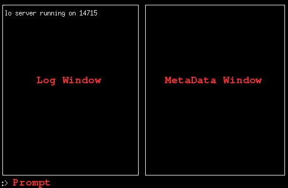

OscPrompt
===========
:Author: Mark McCurry

What Is Oscprompt?
------------------

Oscprompt is an interactive prompt designed for simple interactions with
applications designed with librtosc, notably ZynAddSubFX.
As long as the application responds with the right metadata over OSC, then there
is no dependency on the backend using librtosc.
Oscprompt can still be used with other OSC apps, however none of the nice
metadata will be displayed.

Oscprompt was originally built as oscsend/oscdump appeared to be insufficient
and typing out the long paths involved in development/debugging.

Getting Started
---------------

Assuming the dependencies are available, building is as easy as

-------------
mkdir build
cd build
cmake ..
make
-------------

Now running oscprompt gives a rather blank window which indicates the port that
oscprompt is running on.

From this view the next step needs to be connecting to some running backend.
Running the example backend results in a printout indicating that it is
listening on port 16033 on one particular run.
'connect 16033' establishes a connection between the two programs.
At this point the metadata window should start displaying the ports in the other
application.

Osc messages can be typed out in and are sent on hitting the enter key.

CAUTION: A no argument version of the path may get sent in an attempt to read
the current value of some parameters, which could envoke unexpected behavior in
non-rtosc applications

ShortCuts
---------

TAB:: Try to autocomplete path when possible
UP:: Go to previous history entry
DOWN:: Go to next history entry
\:: Add 1 to parameter
]:: Subtract 1 from parameter
|:: Add 10 to parameter
}:: Subtract 10 from parameter

